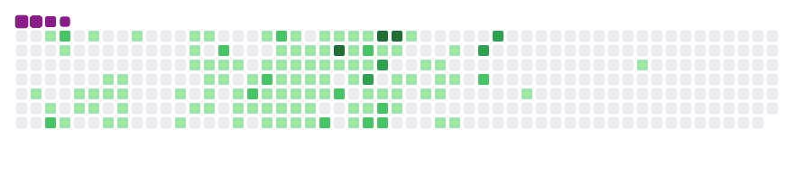

###                            Welcome to My GitHub Page 👋

  

### B.Hasan Hira
AWS Cloud & Devops Engineer | AWS Solution Architect | Electric and Electronic Engineer

- 🔭 I have just finished AWS Cloud % Devops IT Couurse at Clarusway IT School.
- 🌱 I'm currently volunteering as a mentor for students after me at Clarusway IT School.
- 🌱 I’m also preparing for AWS certificates.
- 💬 I am passionate to learn and cooperate, and I am eager to share my knowledge
- 📫 How to reach me:   

 

 
 **Languages and Tools:**
 
 

  <code></code>
  <code></code>
  <code></code>
  <code></code>
   
  <code></code>
  <code></code>
  <code></code>
   
  <code></code>
  <code></code>
  <code></code>
  <code></code>
   
  <code></code>
  <code></code>
  <code></code>
  <code></code>
    

